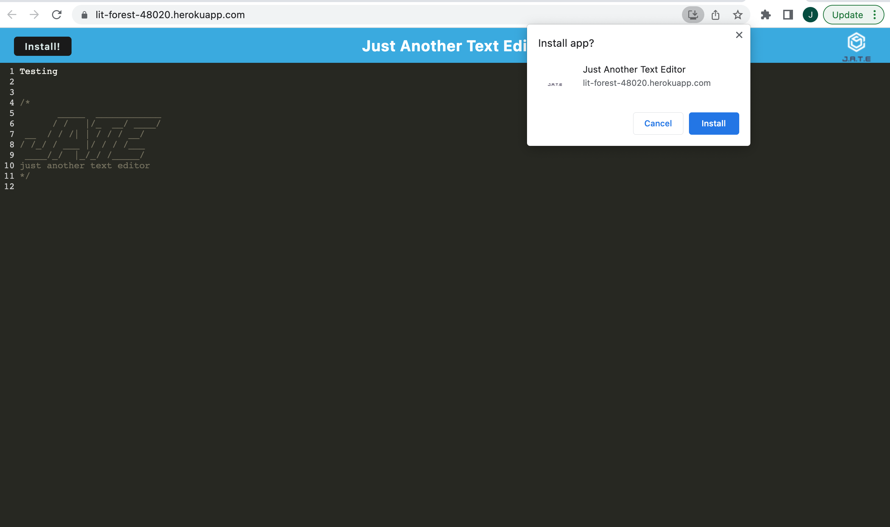

# Text Editor Challenge 

## Table of Contents

* [Description](#description)

* [Installation](#installation)

* [Contributing](#contributing)

* [Media](#media)

* [License](#license)

* [Questions](#questions)

## Description

This application is a text editor with client-server folder structure, and when you run 'npm run start' at the root of the directory, the app starts and the back end serves the front. Webpack bundles the JavaScript files. The html file, service worker, and manifest files are generated. The text editor functions in the browser and uses IndexedDB for database storage. The content entered in the text editor stays by retrieving from the IndexedDB. The app can be installed via the install button, and it runs with an icon on the desktop. There is a regeistered serviceworker using workbox, and it has been deployed to Heroku.

## Installation

Run the command 'npm run start' from the root of the directory.

## Contributing

Jack Warrick

## Media

**Link to Deployed Application:**

[Link to Deployed Application](https://lit-forest-48020.herokuapp.com/)

-----

**Screenshot of running application:**

## License

This application is covered under the MIT License.

## Questions

For more information, please reference my GitHub profile [here](https://github.com/JackWarrick), or reach out to my email: j.d.warrick@comcast.net.

